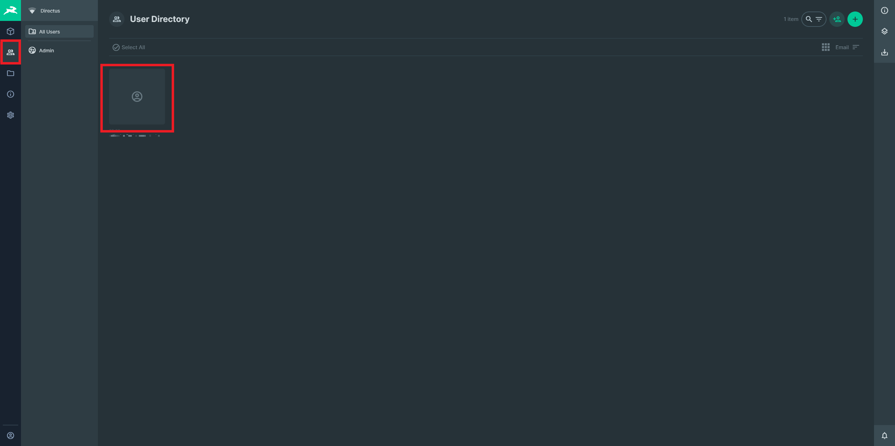

# Post-Deploy Steps

There is very little else to do;
at this point we simply need to ensure that the API can make
authenticated requests agains the CMS, and that our funding
account has a balance.

## 1. Add token to admin user

The API was deployed with a `CMS_ACCESS_TOKEN` environment variable,
and the CMS should have an initial admin user created from the
`ADMIN_EMAIL` and `ADMIN_PASSWORD` variables during the initial deploy.

Now we need to log into the CMS website, visit the User Directory,
and click the empty thumbnail for the newly-created user.

> 

Scroll down to the bottom, copy the value of the `CMS_ACCESS_TOKEN`
API environment variable, paste it into the "Token" field,
and click the green checkmark to save.

> 

Assigning the token to this user allows the API to make authenticated
requests against the CMS.
Without this step, API background tasks that look for pack templates, etc. will fail
to run, meaning we cannot create assets on the blockchain.

## 2. Verify funds for Algorand account

If the funding account does not have a high enough balance,
NFTs cannot be created on the blockchain,
sales cannot proceed, and users cannot even create new accounts.

Ensure that the account has a balance by visiting the
[TestNet](https://testnet.algoexplorer.io/) or
[MainNet](https://algoexplorer.io/) AlgoExplorer portal
(depending on which network your `ALGOD_HOST` is connected to)
and pasting in your account's **public address**.

If the balance is too low, fund the account with your chosen method,
or use the
[Algorand dispenser](https://bank.testnet.algorand.network/)
for TestNet.

---

## Next Up

Congratulations! You should now be ready to log into the CMS
and start creating some NFTs and packs. 🎉🥳🎉
