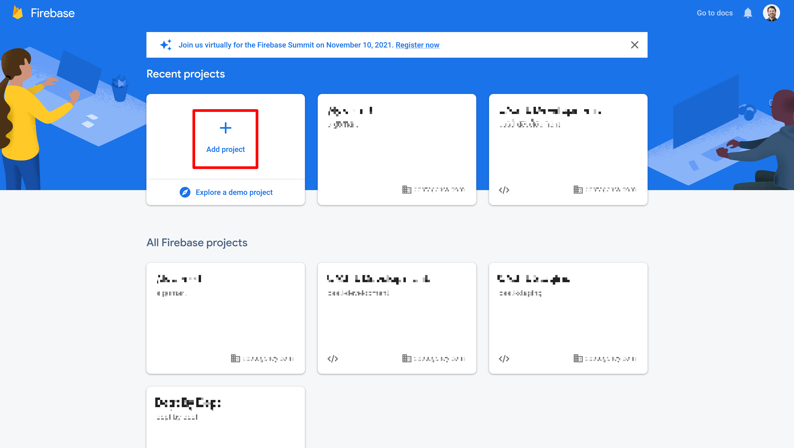
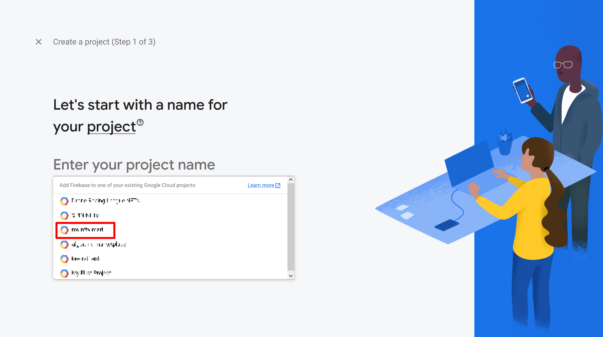
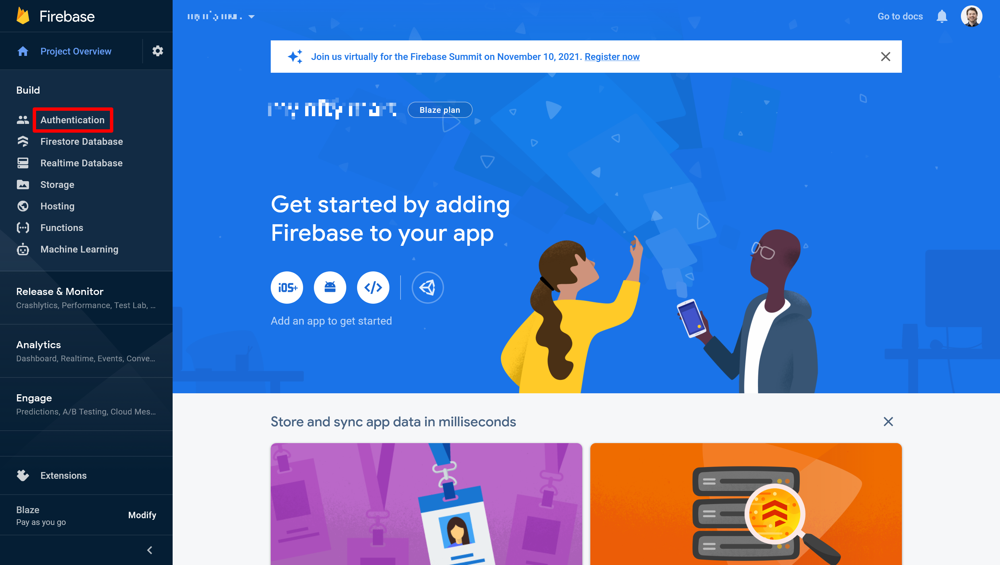
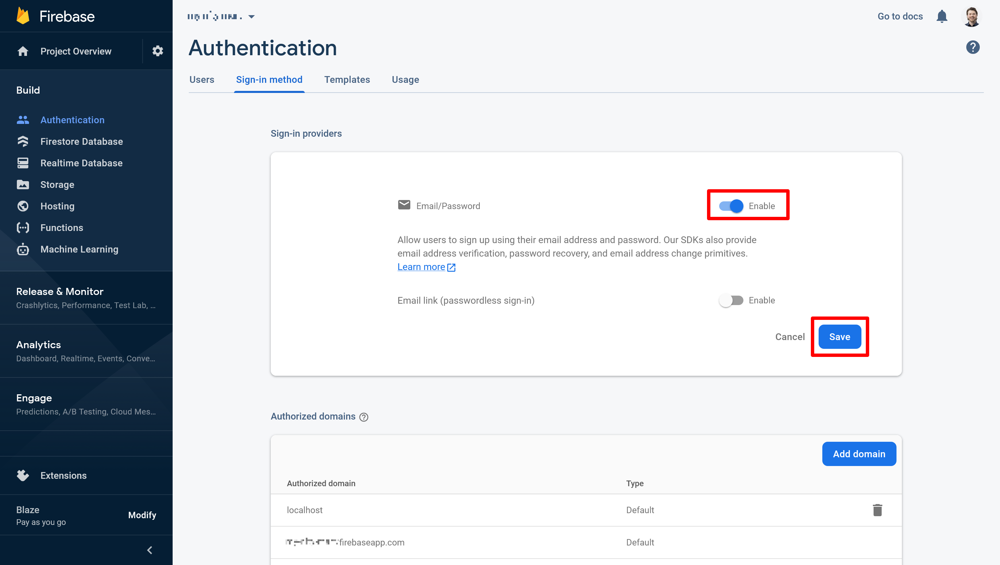
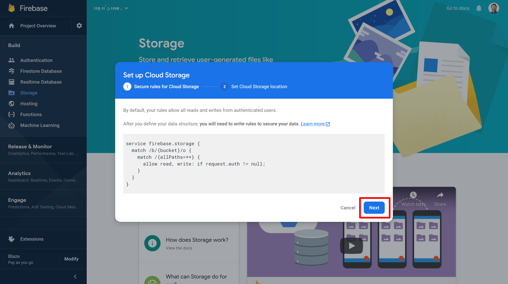
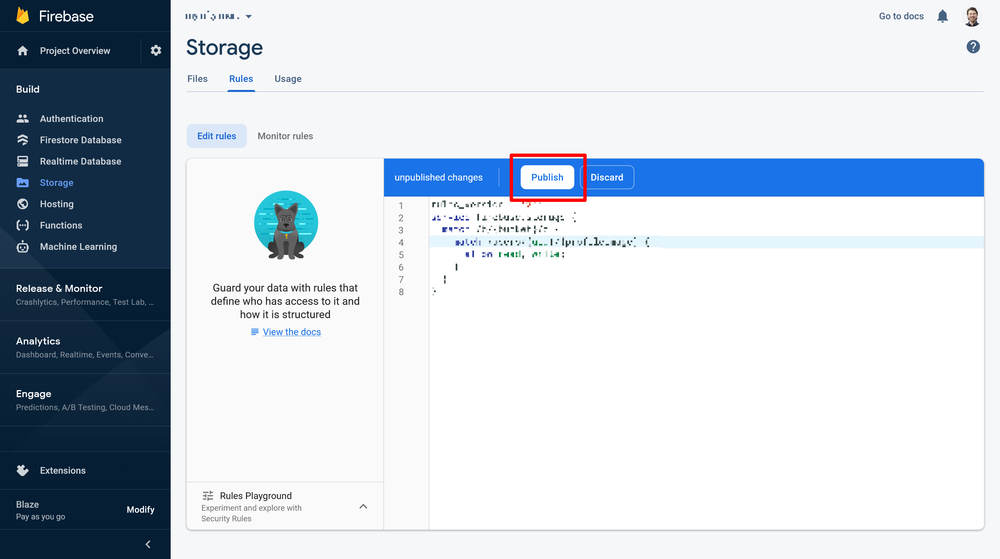
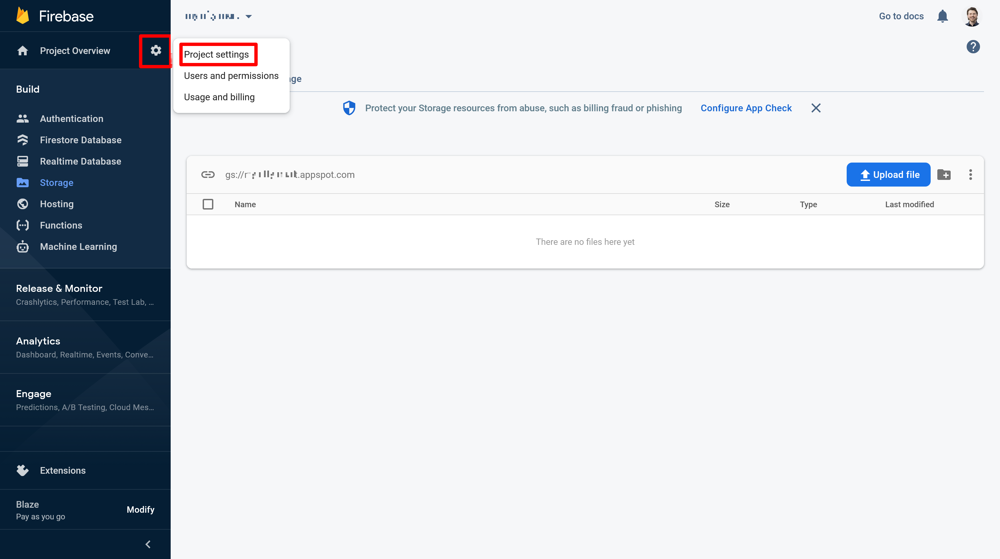

# Configuring Firebase

Firebase is used to configure authentication in the front-end app,
allowing users a plethora of options for logging in to our app
and creating accounts.

Now that we have a GCP project and custom domains set up,
we can fully configure Firebase, which will give us several things:

- A publicly-viewable "config" object for our client-side web app
- Another service account for server-side auth middleware

For this tutorial, we assume that we want to offer users several strategies for signing on...

- Email & password signup
- Google SSO

... but you are free to choose your own sign-on strategies.

## Table of Contents

- [Initialize Firebase](#initializing-firebase)
- [Set up authentication](#set-up-authentication)
- [Enable storage](#enable-storage)
- [Configure the web app](#configure-the-web-app)

## Initializing Firebase

Visit console.firebase.google.com to get started.
We will want to select "Add project".

> 

Next, search for and select the name of the GCP project we
[previously created](../configure-gcp/README.md#create-the-project)
and click "Continue".

> 

> 

Take note of the "a few things to remember" -
especially the warning that **if you delete your Firebase project,
it will delete the associated GCP project**.
Then click "Continue".

> 

Now decide on whether or not you want to enable analytics
and click "Continue".

> 

## Set up authentication

From the project overview, select "Authentication" from the
sidebar menu.

> 

Then click "Get started" to... get started.

> 

Next, select "Email/Password".

> 

We will choose not to allow password-less sign-on,
but feel free to do so.
Select "Enable" and then click "Save".

> 

To add another strategy, for instance Google SSO,
select "Add new provider" and follow the instructions.

> 

When you are done configuring log-in options,
now add the same domain used for the web front-end
when [configuring DNS for domain-mapping(../registering-domains/README.md)
as an authorized domain.

Following the previous tutorial, we would click "Add domain",
fill in dev.example.com, and click "Add".

> 

## Enable storage

Next we need to configure storage rules.
In the sidebar menu, select "Storage" and then
click "Get started".

> 

We cannot alter the rules here, so just click "Next".

> 

Now select a region for storage and click "Done".
It probably makes sense to select the same region that your
base GCP project is in.

> 

Next, select the "Rules" tab.

> 

Now copy the following rules...

```
rules_version = '2';
service firebase.storage {
  match /b/{bucket}/o {
    match /assets {
      allow read, write;
      match /{allPaths=**} {
        // Allow access by all users
        allow read, write;
      }
    }
	match /users/{uid}/{profileImage} {
      allow read, write;
    }
  }
}
```

... and paste into the editor field and click "Publish".

> 

## Configure the web app

In the sidebar menu, select "Project settings".

> 

Scroll to the bottom of the page and select the "</>" button
to configure a new web app.

> 

Add a nickname for the web app and select "Register app".

> 

Next, copy the highlighted public, client-side config object
and save somewhere - we will need this later when configuring Github Secrets.

After saving the configuration details, select "Continue to console".

> 

Once more, go into "Project settings", select the
"Service accounts" tab, and then click
"Generate new private key".

> 

Click "Generate key" and then save the resulting JSON somewhere -
we'll need this as well when configuring Github Secrets.

> 

If you then visit console.cloud.google.com and click through
to "IAM & Admin -> Service Accounts" you should see a new
service account linked to Firebase.

> 
